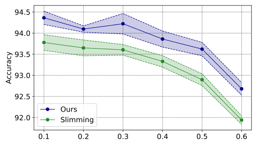
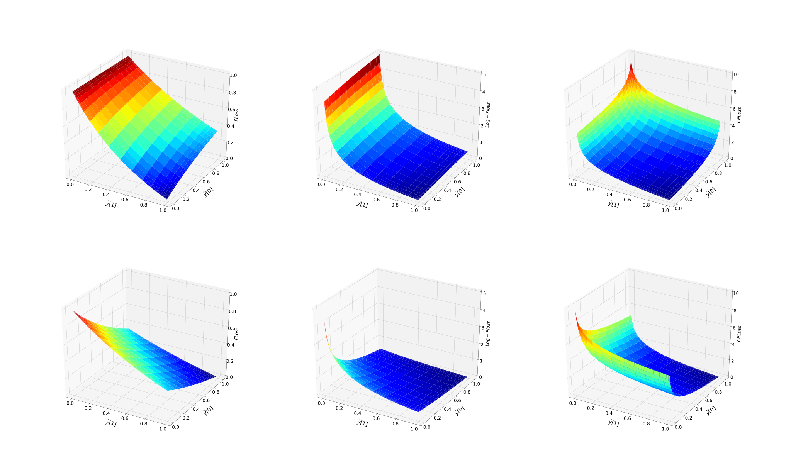
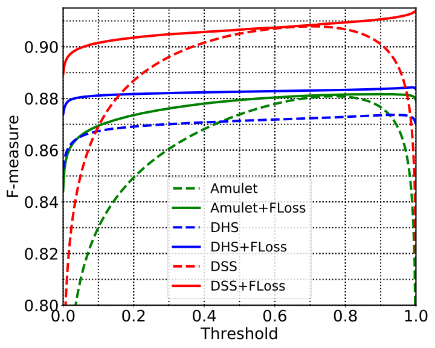
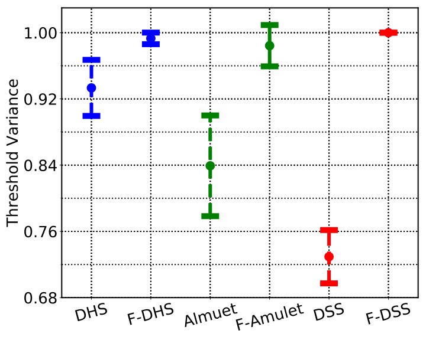

<h1 align="center">Collection of matplotlib figures.</h1>

This is a collection of plots in my co-authored papers.
These figures are mainly made by [matplotlib](https://matplotlib.org/).
Here  are some examples:

* [sensitivity](sensitivity.py)

* [Loss surface](floss-surface/)

* [F-measure vs threshold](f-thres/)

* [Thres variation](thres-variation/)

